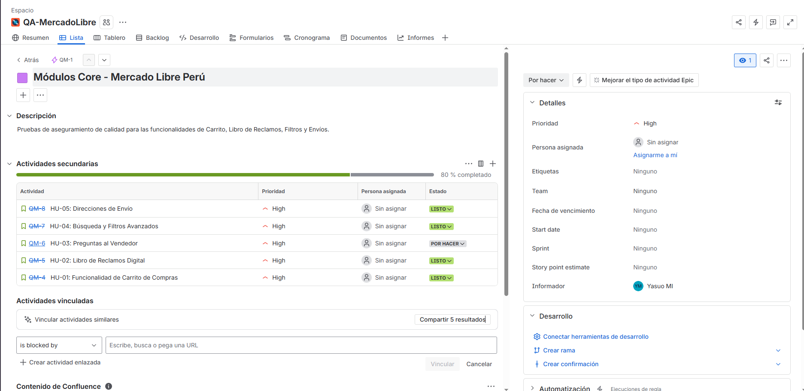
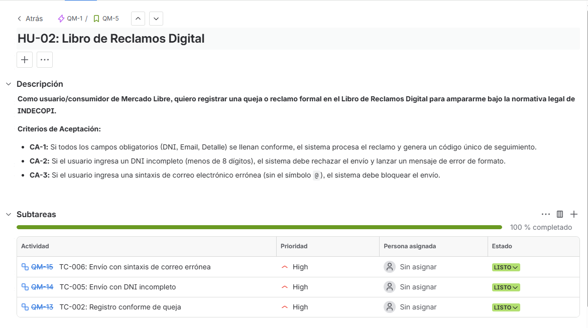
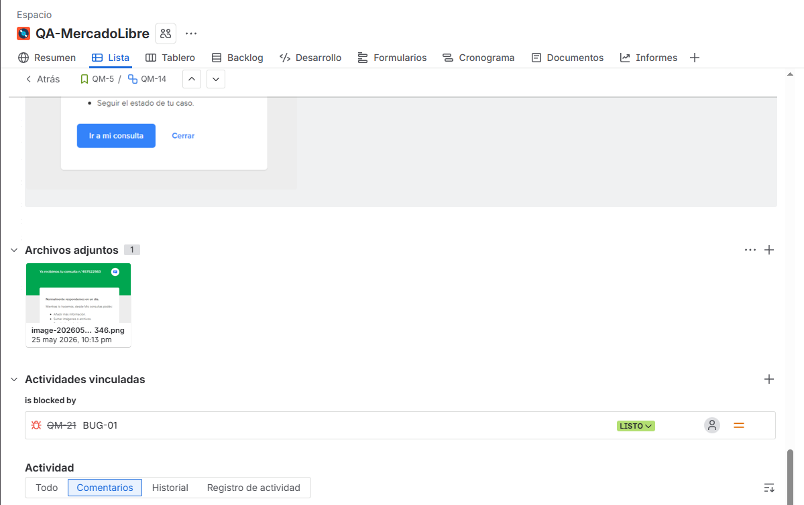
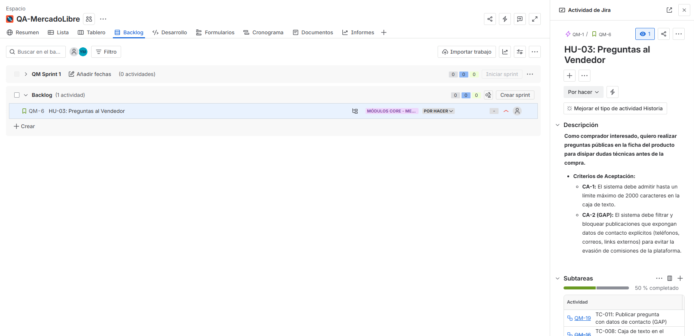

## UNIVERSIDAD NACIONAL DE SAN CRISTÓBAL DE HUAMANGA
## FACULTAD DE INGENIERÍA DE MINAS, GEOLOGÍA Y CIVIL
## ESCUELA PROFESIONAL DE INGENIERÍA DE SISTEMAS

---

**ASIGNATURA:** IS-489 Pruebas y Aseguramiento de Calidad de Software  
**DOCENTE:** Ing. Lizbeth Jaico Quispe  
**SEMESTRE:** 2026-I 
**ESTUDIANTE:** Jhon Eymer Velarde Yllisca  
**LABORATORIO:** Laboratorio 04: Trazabilidad entre Requisitos y Pruebas  

---
---

## 1. INTRODUCCIÓN Y DESCRIPCIÓN DEL SISTEMA
Para el desarrollo de esta guía de laboratorio se seleccionó la plataforma de comercio electrónico **Mercado Libre Perú**. El enfoque del aseguramiento de la calidad (QA) se centró en evaluar la robustez, consistencia lógica y validaciones de datos en cinco de sus componentes o módulos críticos core:
* Módulo de Carrito de Compras (Gestión de Stock).
* Formulario Legal del Libro de Reclamos Digital.
* Módulo de Interacción (Preguntas al Vendedor).
* Módulo de Búsqueda y Filtros Avanzados de Precios.
* Módulo Logístico de Direcciones de Envío.

---

## 2. HISTORIAS DE USUARIO (HU) Y CRITERIOS DE ACEPTACIÓN (CA)

### HU-01: Funcionalidad de Carrito de Compras
* **Descripción:** Como comprador de Mercado Libre, quiero gestionar productos en el carrito de compras para asegurar que las cantidades seleccionadas coincidan con el inventario real antes de proceder al pago.
* **Criterios de Aceptación:**
    * **CA-1:** Si el producto tiene stock disponible, el sistema permite añadirlo y actualiza el contador.
    * **CA-2:** Si el usuario intenta agregar una cantidad superior al stock publicado, el sistema debe bloquear la acción y mostrar una alerta restrictiva.
    * **CA-3:** Si el usuario digita `0` o valores negativos en el checkout, el sistema debe restablecer el valor mínimo a 1 o remover el ítem de forma segura.
    * **CA-4:** Si el usuario selecciona exactamente el tope máximo del inventario, el sistema debe aceptarlo pero deshabilitar el botón de incremento (+).

### HU-02: Libro de Reclamos Digital
* **Descripción:** Como usuario/consumidor de Mercado Libre, quiero registrar una queja o reclamo formal en el Libro de Reclamos Digital para ampararme bajo la normativa legal de INDECOPI.
* **Criterios de Aceptación:**
    * **CA-1:** Si todos los campos obligatorios (DNI, Email, Detalle) se llenan conforme, el sistema procesa el reclamo y genera un código único de seguimiento.
    * **CA-2:** Si el usuario ingresa un DNI incompleto (menos de 8 dígitos), el sistema debe rechazar el envío y lanzar un mensaje de error de formato.
    * **CA-3:** Si el usuario ingresa una sintaxis de correo electrónico errónea (sin el símbolo `@`), el sistema debe bloquear el envío.

### HU-03: Preguntas al Vendedor
* **Descripción:** Como comprador interesado, quiero realizar preguntas públicas en la ficha del producto para disipar dudas técnicas antes de la compra.
* **Criterios de Aceptación:**
    * **CA-1:** El sistema debe admitir hasta un límite máximo de 2000 caracteres en la caja de texto.
    * **CA-2 (GAP):** El sistema debe filtrar y bloquear publicaciones que expongan datos de contacto explícitos (teléfonos, correos, links externos) para evitar la evasión de comisiones de la plataforma.

### HU-04: Búsqueda y Filtros Avanzados
* **Descripción:** Como usuario comprador, quiero aplicar filtros de rangos de precios personalizados para refinar los resultados según mi presupuesto.
* **Criterios de Aceptación:**
    * **CA-1:** Si el usuario ingresa un precio mínimo mayor que el precio máximo (rango contradictorio), el sistema debe corregir automáticamente el flujo, omitir la búsqueda o alertar del error de lógica.

### HU-05: Direcciones de Envío
* **Descripción:** Como comprador activo, quiero registrar mi dirección exacta y un número telefónico de contacto para asegurar la correcta entrega logística del paquete.
* **Criterios de Aceptación:**
    * **CA-1:** El sistema debe validar que el número telefónico ingresado cumpla con la longitud y características de una línea móvil/fija válida.
    * **CA-2 (GAP):** El sistema no debe permitir almacenar direcciones si se dejan vacíos los campos mandatorios de Calle o Departamento.

---

## 3. MATRIZ DE TRAZABILIDAD DE REQUISITOS (RTM)

A continuación se detalla la Matriz de Trazabilidad Completa que vincula las Historias de Usuario, sus Criterios de Aceptación, los Casos de Prueba (TC) diseñados, sus prioridades y los estados obtenidos tras la ejecución en el entorno de producción de Mercado Libre Perú:

| ID HU | Criterio de Aceptación (CA) | ID Caso Prueba (TC) | Título del Caso de Prueba | Prioridad | Técnica QA | Resultado | Incidencia / Bug Asociado |
| :--- | :--- | :--- | :--- | :--- | :--- | :--- | :--- |
| **HU-01** | CA-1 | **TC-001** | Agregar producto con stock disponible | Alta | PE-Válida | **PASS** | N/A |
| **HU-01** | CA-2 | **TC-003** | Agregar cantidad superior al stock publicado | Alta | PE-Invalida | **PASS** | N/A |
| **HU-01** | CA-3 | **TC-004** | Modificar cantidad a cero o valores negativos | Alta | PE-Invalida | **PASS** | N/A |
| **HU-01** | CA-4 | **TC-007** | Selección exacta del stock límite máximo | Media | AVL | **PASS** | N/A |
| **HU-02** | CA-1 | **TC-002** | Registro conforme de queja en el Libro | Alta | PE-Válida | **PASS** | N/A |
| **HU-02** | CA-2 | **TC-005** | Envío de reclamo con DNI incompleto | Alta | PE-Invalida | **FAIL** | **BUG-01** |
| **HU-02** | CA-3 | **TC-006** | Envío de reclamo con sintaxis de correo errónea | Alta | PE-Invalida | **FAIL** | **BUG-02** |
| **HU-03** | CA-1 | **TC-008** | Caja de texto de pregunta en el límite (2000) | Media | AVL | **PASS** | N/A |
| **HU-03** | CA-2 | **TC-011** | Publicar pregunta con datos de contacto **(GAP)** | Alta | Edge-Case | **PEND** | N/A |
| **HU-04** | CA-1 | **TC-009** | Filtro de precio personalizado contradictorio | Media | Edge-Case | **PASS** | N/A |
| **HU-05** | CA-1 | **TC-010** | Registro de dirección con teléfono inválido | Alta | Edge-Case | **PASS** | N/A |
| **HU-05** | CA-2 | **TC-012** | Registro de dirección sin campos obligatorios **(GAP)**| Alta | PE-Invalida | **PEND** | N/A |

---

## 4. DETECCIÓN DE GAPs Y CASOS DE PRUEBA COMPLEMENTARIOS

Durante el análisis backward de trazabilidad se identificaron dos importantes brechas (GAPs) donde las reglas de negocio de la plataforma no estaban siendo cubiertas por ningún caso de prueba del ciclo anterior. Se procedió al diseño de los siguientes TCs complementarios:

1.  **TC-011 [GAP de HU-03]:** Intento de publicación de una pregunta insertando un número telefónico de 9 dígitos. Su fin es probar el comportamiento del filtro preventivo de transacciones externas. Estado actual en Jira: `To Do` (Por Hacer).
2.  **TC-012 [GAP de HU-05]:** Envío del formulario de nueva dirección omitiendo el campo obligatorio de calle. Evalúa si los mecanismos front-end/back-end impiden que se guarden datos logísticos inservibles. Estado actual en Jira: `To Do` (Por Hacer).

---

## 5. REPORTES DE INCIDENCIAS (BUGS LOG)

Al ejecutar los casos de prueba sobre el Libro de Reclamos Digital, se encontraron dos vulnerabilidades críticas que rompieron los criterios de aceptación establecidos (CA-2 y CA-3), procediéndose a su respectivo reporte técnico:

* **BUG-01 (Bloquea a TC-005):** El formulario del Libro de Reclamos de la plataforma procesó de manera exitosa el envío de una queja formal ingresando un número de DNI de solo 5 dígitos numéricos. Esto viola la validación lógica de longitud del documento de identidad en el Perú (8 dígitos).
* **BUG-02 (Bloquea a TC-006):** El sistema admitió el envío de un reclamo adjuntando un correo de contacto carente de la estructura mínima indispensable (`ejemplo.com` sin el símbolo `@`). Esto genera un problema legal grave, imposibilitando la notificación de respuesta dentro de los plazos normativos.

---

## 6. EVIDENCIAS DE CONFIGURACIÓN Y REPLICACIÓN EN JIRA

Para la revisión interactiva y auditoría del proyecto, se ha configurado el entorno dinámico en la plataforma Atlassian Jira. El acceso al tablero, flujos de trabajo, estados y relaciones de trazabilidad se puede verificar de forma directa a través del siguiente enlace:

🔗 **LINK DEL PROYECTO EN JIRA:** [https://hagen-041.atlassian.net/jira/software/projects/QM/list?jql=project+%3D+QM+ORDER+BY+resolution+DESC%2C+cf%5B10019%5D+ASC&atlOrigin=eyJpIjoiY2E4NjAyYTYwN2ZlNDVmODkyYjNlMGViY2IwNTE0ZWUiLCJwIjoiaiJ9]

A continuación, se adjuntan las capturas de pantalla que validan la correcta implementación de la RTM y su respectivo árbol jerárquico dentro de la plataforma (Proyecto: `QA-MercadoLibre`):

### 6.1. Vista General del Epic y Vinculación de Historias de Usuario
Se visualiza el Epic Principal `Módulos Core - Mercado Libre Perú` (QM-1) conteniendo adecuadamente las cinco (5) Stories hijas ordenadas.

> 📸 ****

### 6.2. Vista de Detalles de una Story, Criterios de Aceptación y Sub-tasks
Detalle de la Historia de Usuario de Carrito de Compras, evidenciando el traslado de los Criterios de Aceptación a la Descripción, la Persona Asignada, su Prioridad y el anidamiento de sus Casos de Prueba correspondientes en estado "LISTO".

> 📸 ****

### 6.3. Trazabilidad Completa de Incidencias (Bugs en Jira)
Evidencia de la HU-02 del Libro de Reclamos, demostrando las sub-tasks en estado "LISTO" (con ejecución fallida en la vida real) y su enlace explícito mediante la relación `is blocked by` hacia las incidencias tipo **Bug** creadas para documentar las fallas de validación de Mercado Libre Perú.

> 📸 ****

### 6.4. Tablero Scrum (Board de Proyecto) con Distribución de Tareas
Captura del tablero del Sprint, donde se aprecia la distribución final de los artefactos QA: los casos ejecutados en la columna `Done` y los dos nuevos casos diseñados para mitigar los GAPs en la columna `To Do`.

> 📸 ****
## 7. CONCLUSIONES

* **Garantía de Cobertura Total (QA Rigor):** La implementación de la Matriz de Trazabilidad de Requisitos (RTM) demostró ser una herramienta indispensable en proyectos de ingeniería de software. Permitir mapear en formato bidirectional (*forward* y *backward*) aseguró que ningún requisito legal o funcional del negocio quedara desprotegido, mitigando de forma temprana los riesgos de software antes del cierre del ciclo.
* **Dinámica del Trabajo en Jira vs. Documentos Estáticos:** La transición de documentar casos de prueba desde un entorno tradicional/estático (como Microsoft Excel o Word) hacia una plataforma de gestión ágil como Jira proporciona visibilidad compartida en tiempo real de los resultados. La posibilidad de generar sub-tareas automatizadas para los TCs y acoplarles directamente tickets de incidentes (Bugs) agiliza la comunicación cross-functional entre los equipos de desarrollo, QA y el Product Owner.
* **Hallazgos Críticos en la Plataforma Evaluada:** Las pruebas efectuadas sobre Mercado Libre Perú evidenciaron fallas de validación críticas en el componente de Libro de Reclamos. El haber permitido el procesamiento de cadenas con formatos de e-mail inválidos e identificaciones incompletas demuestra la necesidad imperiosa de robustecer las pruebas de caja negra del tipo análisis de valores límite (AVL) y partición de equivalencia (PE) del lado del servidor, demostrando que incluso plataformas comerciales masivas requieren auditorías continuas de control de calidad.